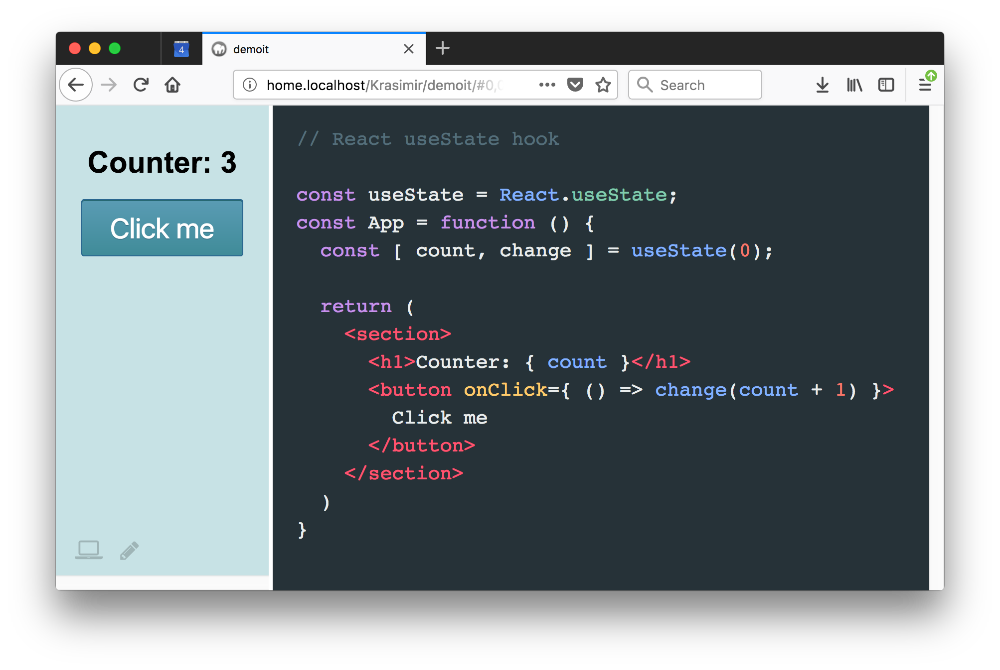

# My new and shiny tool for live demos

I had some time during the weekend and decided to work on my slides for an [event](http://partialconf.com/) at the end of the month. I reached the part where I have to do a live coding session and I was wondering what tool to use. At the end I created my own called [Demoit](https://github.com/krasimir/demoit). This is a short article explaining how it works.



[Demoit](https://github.com/krasimir/demoit) - a small tool for live coding exercises. Demo [here]([https://krasimir.github.io/demoit/dist](https://krasimir.github.io/demoit/dist)).

## The idea

I have to say that I'm not doing a lot of live coding at my talks. I usually create slides with the code so I avoid the stress of writing it in front of people. However, sometimes it feels better if the attendees see how the code actually changes. So, I was going to use one of the popular tools for the purpose - [CodeSandbox](https://codesandbox.io), [JSBin](https://jsbin.com) or [Codepen](http://codePen.io). But then I realized that those tools are offering a lot more than I wanted. I was searching for something small that meets my requirements. And, as it often happens with us engineers, I ended up writing my one solution. Here is what I am searching for and what [Demoit](https://github.com/krasimir/demoit) does at the moment.

* A nice editor with couple of themes so I feel comfortable writing - I used the well known [CodeMirror](https://codemirror.net/).
* No server - I don't want to run a node server every time when I want to do a live coding demo. It is just one more thing that may go wrong and when you are in front of other people this may ruin the whole presentation. I also don't want to use a service that depends on having internet connection. Even though some of the tools that I mention above support offline mode I'm still reserved to such option.
* Built-in transpilation - [Demoit](https://github.com/krasimir/demoit) uses Babel as a transpiler. It does the transformation at runtime, in the browser.
* No dependencies. No building process. Just a simple HTML page and static JavaScript and CSS files - my goal with this is to avoid downloading packages and configuring building process. It's just my code running on top of libraries loaded via `<script>` tag.
* Flexible configuration - there are two things here - (a) ability to define my own resources and libraries. For example JavaScript and CSS files that my demo needs. And (b) ability to define multiple demos and code snippets so I can switch quickly between them directly from the tool. This is done by filling a single `settings.json` file.
* Ability to render to html but also print to the console - this is pretty much trivial for such instruments

## The default configuration

Here is how `settings.json` looks like when you download Demoit. It pretty much contains all the available features.

```js
{
  "editor": {
    "theme": "material",
    "<nice themes>": "dark: material, light: neat"
  },
  "resources": [
    "./resources/react-16.7.0-alpha.0.js",
    "./resources/react-dom.16.7.0-alpha.0.js",
    "./resources/styles.css"
  ],
  "demos": [
    {
      "snippets": [
        "./demos/useHooks.js",
        "./demos/HoC.js",
        "./demos/FaCC.js"
      ]
    }
  ]
}
```

The files under the `resources` field are locally saved on my machine and the tool is adding them to the page before running my demo. The actual code snippets are described under the `demos` field.

## Final words

I will be more then happy if you try Demoit and let me know what you think. The demo of this tool for doing demos is available here [https://krasimir.github.io/demoit/dist](https://krasimir.github.io/demoit/dist). If you want to report a bug or who knows maybe doing a pull request go at [this](https://github.com/krasimir/demoit) URL.